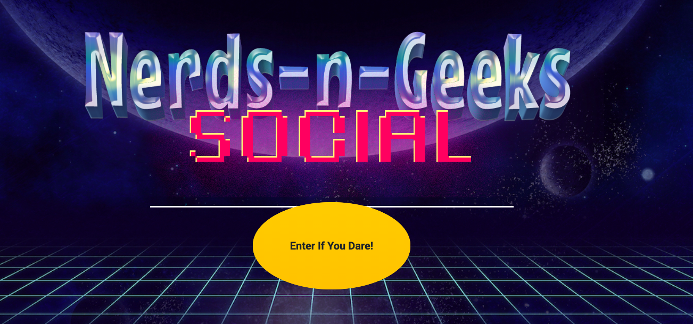

#Nerds-N-Geeks trivia

This is a trivia game that consist of 10 random question about various topics.

#The technology used was
Bootstrap, Pug(Jade), CSS, SCSS, and Javascript

#Unsolved problems:

Attempting to make Modals function on Pug framework.

#Installation:
-- Open the index.html file in the browser (preferably anything but Internet Explore)

-- click on the yellow circle that takes you to the quiz.

-- To start quiz click on the power (start) button

##DEFINITION OF GEEKS & NERDS
An individual can be bother nerdy and geeky at the sme time
###Geek:
A unique individual who has a huge fascination with pop culture, on matter how popular it actually is for example: Red Dwarf, DC/Marvel Universe, Star Wars, Game of Thrones

###Nerd:
A unique individual who has a huge fascination with more intellectual things for example: Pi, String Theory, Algorithms, Parallel Universe, Butterfly Effects, Dr Who

